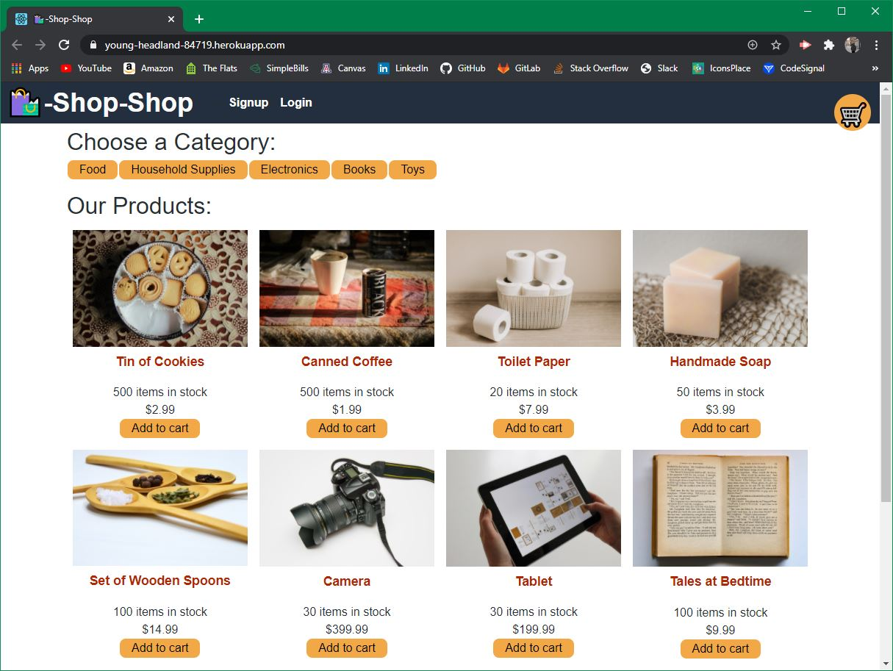

# Shop Shop

## Description
Shop Shop is a Ecommerce platform that utilizes MongoDB, ExpressJS, ReactJS, NodeJS, and Stripe. An existing webpage was refactored to have a global state control the data for the categories, products and shopping cart. Additionally, I added the abilitiy to check out with stripe and offline capabilities with IndexedDB.
<br>Deployed Application: https://young-headland-84719.herokuapp.com/

##


## Usage
Navigate to root directory and run:
  ```
  npm install 
  npm run seed
  npm start
  ```

## Contributors
Joseph DeFelice

## Contact
If you have any questions, contact the author directly at defelicejoseph@outlook.com.